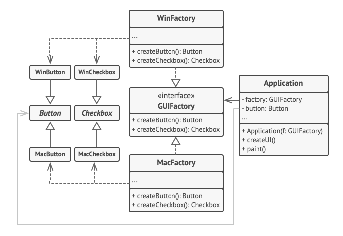

 

 

## Description

Similar to factory method in many ways.

There are several independent classes of items: `Item1`, `Item2`, `Item3`. Each of items also variate in several categories of sub-type: `Item1_Cat1`, `Item1_Cat2`, `Item1_Cat3`, `Item2_Cat1`, `Item2_Cat2`, etc.

To better organize the process of creation of items of the same category, we make an abstract `ItemCreator` class with child-classes for each category: `ItemCreator_Cat1`, `ItemCreator_Cat2`, `ItemCreator_Cat3`. 

The object of type `ItemCreator` (initialized with one of its implementations) will be used in the application every time we need to create one of the items.

It is similar to factory method, but unlike `Container` from FM, `ItemCreator` is strictly specialized only on objects creation.

### Benefits
* fulfills [[SOLID - O - Open-closed principal|OCP]] (from [[SOLID]])
* adding new type of `Item` becomes easier: less places to modify code, less ways of making a mistake
* it separates the general logic from the particular implementations 

### Disadvantages
* assumes that `Item#_Cat#` forms a Cartesian product of `Cat# * Item#` - loads of classes to be made