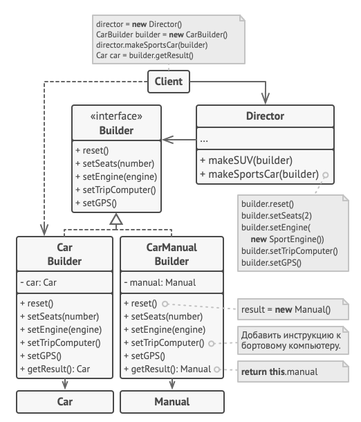

<div align="center"> 

 </div>

 Description
It helps creating new objects of classes with way too many parameters of inner state.

Instate of 
```c#
item = new Item(12, 8, null, "abc", null, true, true, false);
```
, you can do something like 
```c#
builder.newItem();
builder.size(12,8);
builder.settingsProfile(SP.DEFAULT);
item = builder.getItem();
```
or even
```c#
var item = builder
  .newItem().size(12,8)
  .settingsProfile(SP.DEFAULT)
  .getItem();
```

`Item1`, `Item2`, etc. - various classes of items with similarities in production process, **but not necessarily sharing the same interface**.

`Builder` is an abstract class, generalizing the stages of items' production.

`Builder1`, `Builder2` implementations of `Builder` for particular objects. Each of them also has a method `getItem()` to return the result of work.

`Director` - an optional facilitator for the process of building. It can store several most common sequences of commands for `Builder`.
### Benefits
* step-by-step creation
* isolates the process of a new object construction in a separated class

### Disadvantages
* the overall complexity of the code increases since the pattern requires creating multiple new classes