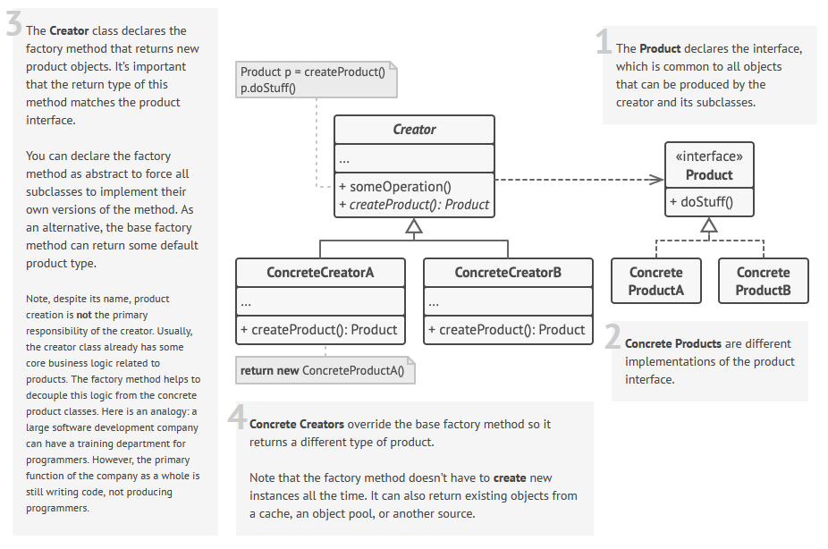

 

 

## Description

This is a creational design pattern.

Let's assume we've got the `Item` abstract class (or maybe an interface) which represents some complex entity. It has several inheriting classes: `ParticularItem_1`, `ParticularItem_2`, `ParticularItem_3`, etc. 

We also have an abstract class called `Container`. The idea of `Container` is that it somehow utilizes the objects of the `Item` class in its inner logic.

The children of `Container` are `ParticularContainer_1`, `ParticularContainer_2` and `ParticularContainer_3`. Each of them uses some special subtype of `Item`, and also the way of initialization may vary.

The idea of **factory method** is that we can determine a special abstract method `Container::createItem(*pars)`. The implementation will be located in `ParticularContainer_#` of course. So we base class (`Container`) will aggregate all the general logic, and the children will be responsible only for the `Item` initialization.

### Benefits
* adding new type of `Item` becomes easier: less places to modify code, less ways of making a mistake
* it separates the general logic from the particular implementations 

### Disadvantages
* each new `Item` subtype requires a new subtype of `Container`, which leads to doubling the class hierarchy 