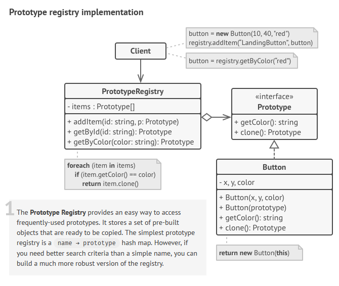

 

 

## Description
Instate of having a complex structure of subclasses, we can use parameterized instances of the base class. Several initialized objects are stored as a preset. They are called *prototypes*.

To create a new object, we take one of the presets and clone it with a special `clone` method implemented in advance.

### Benefits
* simplifies the process of initializing new objects
* allows shrinking the amount of subclasses 
### Disadvantages
* the implementation of the `clone` method can become quite tricky for composite objects