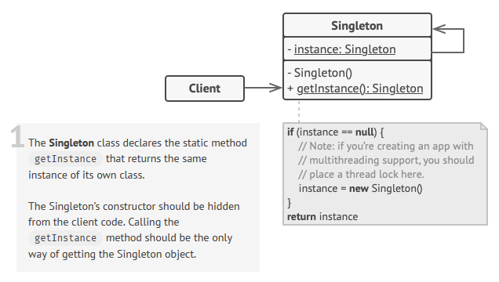

 

 

## Description

Singleton is a class with only one shared instance, which can be invoked from any place in program, and is guarantied to be initialized only once.

It can be achieved in several ways, including but not limited to: private constructors, decorators, inheritance, meta-classes, module imports (just one object, initialized inside module) etc.

This design pattern is actually not in favor. There's a couple of reasons when it's usage is justified:
1. The singleton's inner state is immutable. Like config values or the set of globally shared constants.
2. The singleton is a global output point. Like a logger.

### Benefits
* no need to spend resources on initialization each time
* easy access to the unified resource from multiple points

### Disadvantages
* it violates **Single responsibility principal**:
	* providing global access to the object 
	* guaranties the singularity of the instance
* the initialization process becomes quite sophisticated if multi-threading is involved (we are to be sure we are not recreating the instance multiple times in parallel threads)
* hard for unit-testing (requires mock-objects creation)