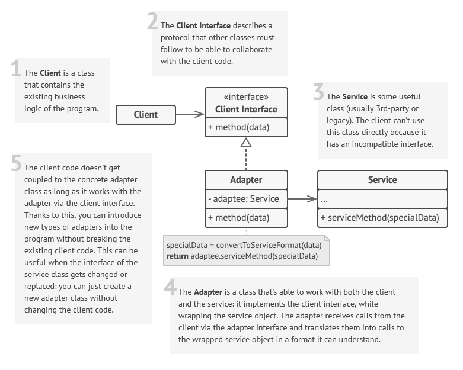

 

 

## Description

Adapter makes two incompatible interfaces compatible.

It wraps the new interface (`Service`) into a child-class (`Adapter`) of an old interface (`Client`). The mechanisms of adjustment and conversion are encapsulated inside the new child-class.

The implementation of this pattern can take two forms:
1. `Adapter` has the instance of `Service` as one of its parameters
2. `Adapter` inherits from both `Service` and `Client` classes

### Difference between Adapter and Bridge
In Adapter both `Client` and `Server` are on the same level of abstraction, though `Server` can only do part of `Client` functionality.
In Bridge the difference between the levels of abstraction (**abstraction** vs. **implementation** juxtaposition) is crucial. `Implementation` foreshadows all the functionality of `Abstraction`.

## Implementation

### API Original to Alternative
This example is maybe not the best one. The reasons why I think so are:
1. `ApiOriginal` and `ApiAlternative` are the entities of the same rank, though in the more general case they are not equal. `ApiAlternative` should extend the capabilities of `ApiOriginal` and not replace them.
2. `ObjAdapter` uses empty constructor to create `ApiAlternative`, but it would be better if it took the instance of this class as a parameter, because in general case the process of `ApiAlternative` initialization can be very tricky.
3. `do_something_with_messages` should be replace with interaction with another class

