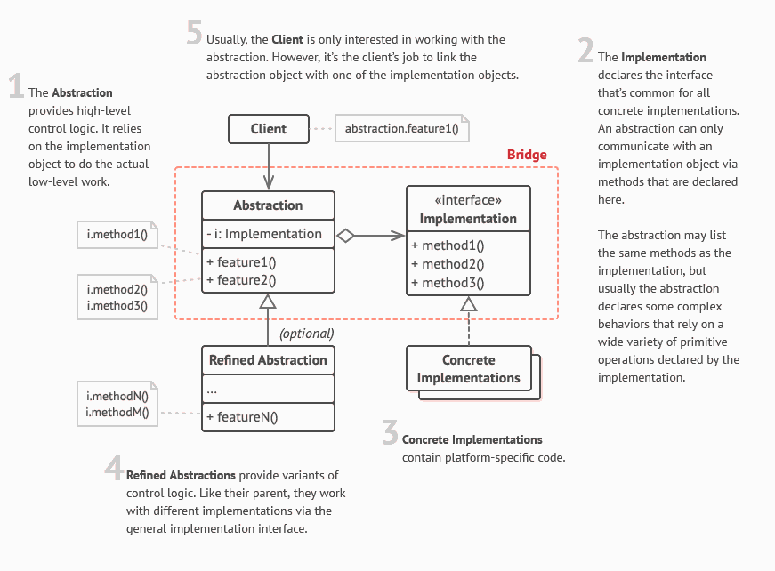

 

 

## Description
The Bridge separates **abstraction** and **implementation**.

In this context abstraction means more high-level operations, while implementation is related to the particular technical details and elementary actions. Abstraction is also used as a synonym to the word "interface" in the most general sense - a bunch of handlers for some black box.

So to use the Bridge pattern, you should isolate the low-level implementation in a separated class hierarchy with (let's call it) `Implementation` interface (or abstract class) on the top defining the elementary operations.

The (let's call it) `Abstraction` class would be having an instance of some `Implementation` scions as its property.

### Examples:

| `Abstraction`          | `Implementation`        |
| ---------------------- | ----------------------- |
| Text Reader            | Voice Engine            |
| Remote Control         | Device Instructions Set |
| Media Player/Converter | Media Codec             |
| News Aggregator        | News Stream (RSS, Atom) |

### Benefits
- good for platform-independently
- implements Open-closed principal from SOLID
- implements Single responsibility principal from SOLID
- hiding low-level details

### Disadvantages
- (as in any other pattern) incised complexity of program structure

### Difference between Adapter and Bridge
In Adapter both `Client` and `Server` are on the same level of abstraction, though `Server` can only do part of `Client` functionality.
In Bridge the difference between the levels of abstraction (**abstraction** vs. **implementation** juxtaposition) is crucial. `Implementation` foreshadows all the functionality of `Abstraction`.