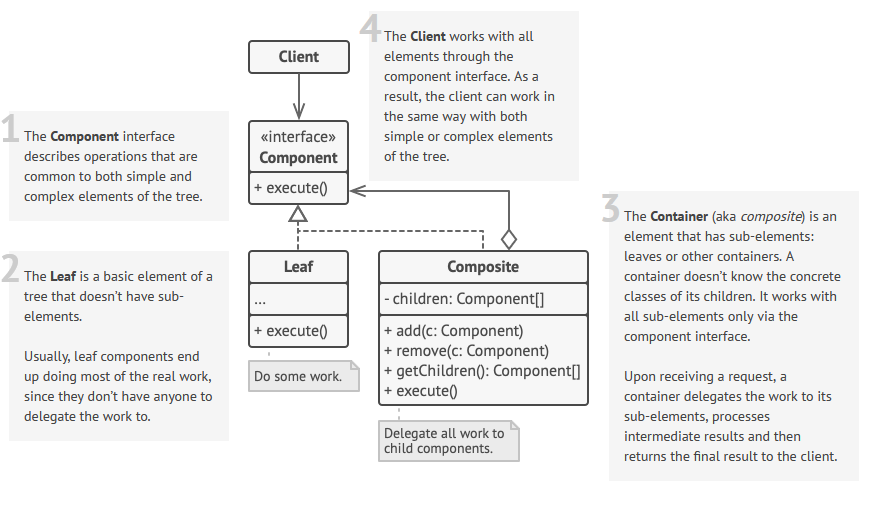

 

 

## Description
It's just a tree structure.

One interface (`Component`) provides method `do_stuff()` (it can be many) and is implemented in two classes:
1. `Leaf` - an atomic element of the structure. Nevertheless, it usually encapsulates all the complexity of the  `do_stuff()` method.
2. `Composite` - a container for `Component` elements (both `Leaf`s and `Composite`s). The `do_stuff()` method is somehow aggregating the `do_stuff()` methods of its children.

### Examples
| `Component`    | `Composite`     | `Leaf`    | `do_stuff()`   |
| -------------- | --------------- | --------- | -------------- |
| LISP statement | `(= (+ 2 2) 4)` | `(+ 2 2)` | `eval()`       |
| file structure | folder          | file      | `render(pos)`  |
| order          | group_order     | product   | `calc_price()` |
