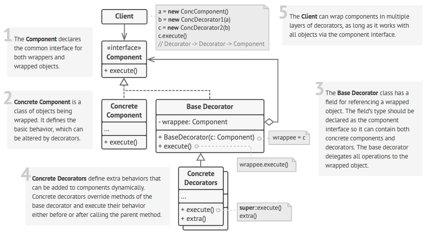

 

 

## Description

Decorator allows to add extra functionality to the objects of some interface.

It allows to extend the class capabilities without inheritance.

### Examples

| Component    | `.do()`            | Decorator1    | Decorator2            |
| ------------ | ------------------ | ------------- | --------------------- |
| `Uploader`   | `.upload(file)`    | `Zip(comp)`   | `Encrypt(comp, pass)` |
| `Backupper`  | `.backup(db_name)` | `Zip(comp)`   | `Copy(comp, path)`    |
| `WebHandler` | `.handle(*pars)`   | `Cache(comp)` | `Log(comp, logger)`   |

### Differences between Proxy and Decorator
The direct quote from the GoF (page 216):
> Although decorators can have similar implementations as proxies, decorators have a different purpose. A decorator adds one or more responsibilities to an object, whereas a proxy controls access to an object.

