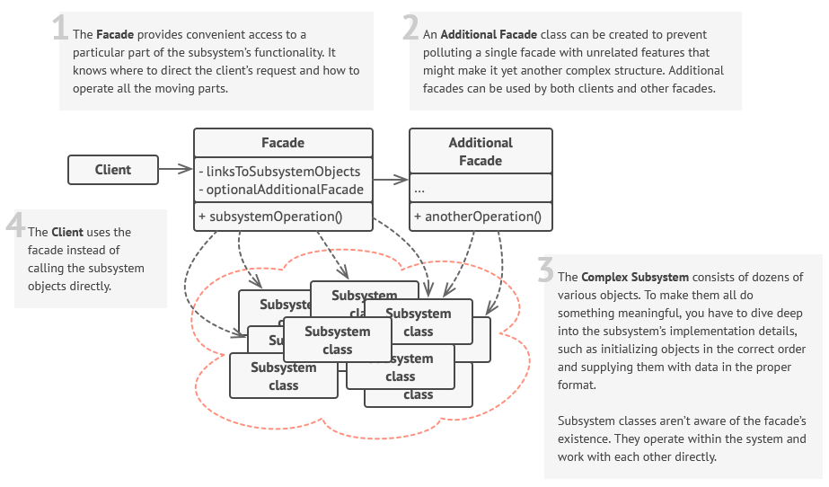

 

 

### Description
One of the easiest patterns because it uses no inheritance.

When we encapsulate functionality of a subsystem of interrelated classes inside of a single `Facade` class, which represents a simplified interface for the subsystem's features.

### Examples

| Subsystem        | `ss_method_1()`     | `ss_method_2()`        | `facade_method_1()`     |
| ---------------- | ------------------- | ---------------------- | ----------------------- |
| `FileSync`       | `subscr_file(path)` | `scan_all_subs()`      | `sync()`                |
| `Canvas2D`       | `startPath()`       | `mvLine(x, y)`         | `draw_rect(x, y, w, h)` |
| `AudioConverter` | `mp3_to_wav()`      | `wav_to_wma(*pars...)` | `convert_to(format)`    |
