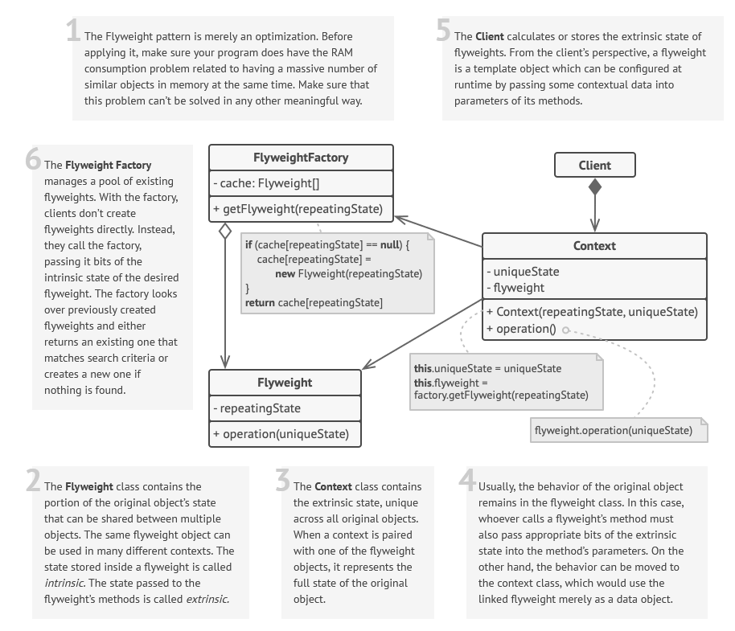

 

 

## Description

Encapsulates the memory consuming but immutable and recurring parts of the object into a specialized class (`Flyweight`). 

When trying to create `Flyweight` object with duplicating data, it just returns the link to the previously created object. That's why it is also referred to as Cache. This can be achieved via [[Programming. Design Patterns. Factory Method|Factory Method]] or [[Programming. Design Patterns. Abstract Factory|Abstract Factory]])

`Flyweight` is mostly oriented on memory saving. 

### Examples

| Context        | Flyweight |
| -------------- | --------- |
| 2d game object | texture   |
