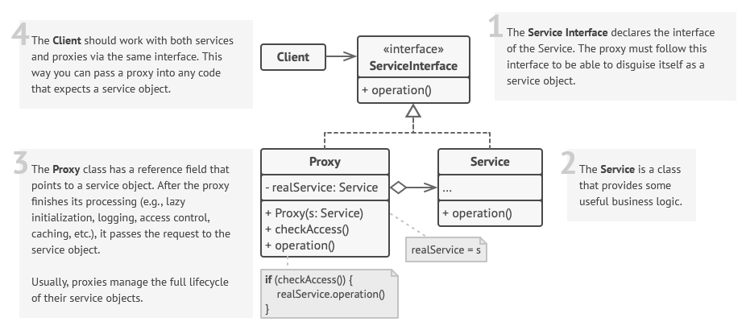

 

 

## Description

### Examples

| Proxy Type       | Service             | Proxy                             |
| ---------------- | ------------------- | --------------------------------- |
| virtual proxy    | `RestoreFromBackup` | lazy initialization               |
| protection proxy | `WebHandler`        | check access rights               |
| remote proxy     | `AudioPlayer`       | run from other device             |
| logging proxy    | (any)               | take logs                         |
| caching proxy    | (any)               | store recent request results      |
| smart reference  | (any)               | shut down service with no clients |

it is very similar to decorator...
### Differences between Proxy and Decorator
The direct quote from the GoF (page 216):
> Although decorators can have similar implementations as proxies, decorators have a different purpose. A decorator adds one or more responsibilities to an object, whereas a proxy controls access to an object.
