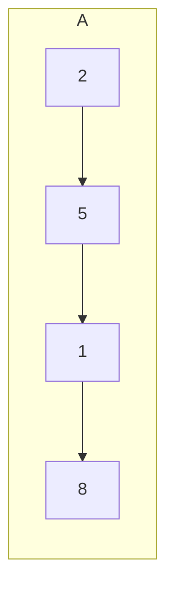
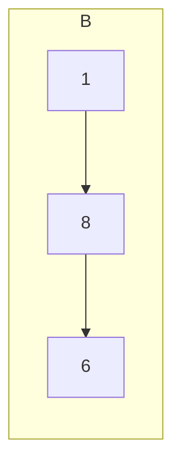
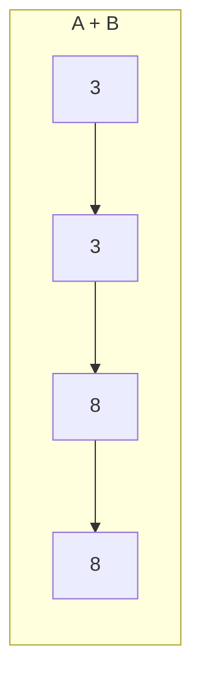

# 2. Add Two Numbers

[link to LeetCode](https://leetcode.com/problems/add-two-numbers/ ) (<span style="color:orange">medium</span>)

## Description
You are given two **non-empty** linked lists representing two non-negative integers. The digits are stored in **reverse order**, and each of their nodes contains a single digit. Add the two numbers and return the sum as a linked list.

You may assume the two numbers do not contain any leading zero, except the number 0 itself.

## Constraints
-   The number of nodes in each linked list is in the range `[1, 100]`.
-   `0 <= Node.val <= 9`
-   It is guaranteed that the list represents a number that does not have leading zeros.


## Examples



## Abstract (TL;DR)
`rec`, `cycle`, `to_int`, `n_lists`

## Thoughts
My first approach:
### Solution 1 (rec)
```python
# Definition for singly-linked list.
# class ListNode:
#     def __init__(self, val=0, next=None):
#         self.val = val
#         self.next = next
class Solution:
    def addTwoNumbers(self, l1: ListNode, l2: ListNode) -> ListNode:
        def rec(head, left, right, acc = 0):
            if not left and not right:
                if acc:
                    head.next = ListNode(1)
                return
            if not left:
                rec(head, right, left, acc)
            elif not right:
                while left:
                    v = left.val + acc
                    acc, v = divmod(v, 10)
                    head.next = ListNode(v)
                    head = head.next
                    left = left.next
                if acc:
                    head.next = ListNode(1)
                return
            else:
                v = left.val + right.val + acc
                acc, v = divmod(v, 10)
                head.next = ListNode(v)
                rec(head.next, left.next, right.next, acc)
                
        head = ListNode()
        rec(head, l1, l2, 0)
        return head.next
```
Loads of borderline cases. Overly complex 😞
### Solution 2 (cycle) ([**stolen**](https://leetcode.com/problems/add-two-numbers/discuss/1016/Clear-python-code-straight-forward))
```python
class Solution:
    def addTwoNumbers(self, l1: ListNode, l2: ListNode) -> ListNode:
        ans = cur = ListNode()
        acc = 0
        while l1 or l2 or acc:
            val = acc
            if l1:
                val += l1.val
                l1 = l1.next
            if l2:
                val += l2.val
                l2 = l2.next
            acc, val = divmod(val, 10)
            cur.next = ListNode(val)
            cur = cur.next
        return ans.next
```

### Solution 3 (to int) ([**stolen**](https://leetcode.com/problems/add-two-numbers/discuss/1102/Python-for-the-win))
This only works due to the long arithmetic support in Python3. Btw it works quite fast.
```python
class Solution:
    def addTwoNumbers(self, l1: ListNode, l2: ListNode) -> ListNode:
        def l2i(lst: ListNode) -> int:
            ans = 0
            mul = 1
            while lst:
                ans += mul*lst.val
                mul *= 10
                lst = lst.next
            return ans
        def i2l(x: int) -> ListNode:
            r, v = divmod(x, 10)
            ans = ListNode(v)
            if r > 0:
                ans.next = i2l(r)
            return ans
        return i2l(l2i(l1) + l2i(l2))
```
### Solution 4 (n-lists) ([**stolen**](https://leetcode.com/problems/add-two-numbers/discuss/1102/Python-for-the-win))
It has a very interesting idea behind it. But it's the slowest.
```python
class Solution:
    def addTwoNumbers(self, l1: ListNode, l2: ListNode) -> ListNode:
        ls = [l1, l2]
        pred = last = ListNode()
        acc = 0
        while ls or acc:
            acc += sum(l.val for l in ls)
            ls = [l.next for l in ls if l.next]
            acc, val = divmod(acc, 10)
            last.next = last = ListNode(val)
        return pred.next
```
