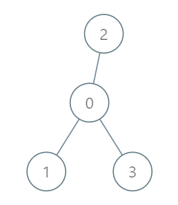
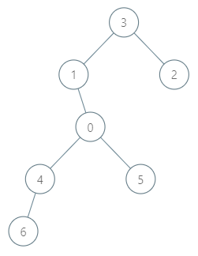

# 2477. Minimum Fuel Cost to Report to the Capital

[link to LeetCode](https://leetcode.com/problems/minimum-fuel-cost-to-report-to-the-capital/description/) (<span style="background-color: #ff0;border-radius: 4px;padding: 0px 4px;font-weight: bold;color: #000;">medium</span>)

## Description
There is a tree (i.e., a connected, undirected graph with no cycles) structure country network consisting of `n` cities numbered from `0` to `n - 1` and exactly `n - 1` roads. The capital city is city `0`. You are given a 2D integer array `roads` where `roads[i] = [ai, bi]` denotes that there exists a **bidirectional road** connecting cities `ai` and `bi`.

There is a meeting for the representatives of each city. The meeting is in the capital city.

There is a car in each city. You are given an integer `seats` that indicates the number of seats in each car.

A representative can use the car in their city to travel or change the car and ride with another representative. The cost of traveling between two cities is one liter of fuel.

Return _the minimum number of liters of fuel to reach the capital city_.

## Constraints

## Examples

### E1


**Input:** `roads = [[0,1],[0,2],[0,3]], seats = 5`

**Output:** `3`

### E2


**Input:** `roads = [[3,1],[3,2],[1,0],[0,4],[0,5],[4,6]], seats = 2`

**Output:** `7`

## Abstract (TL;DR)
Recursion. 
`rec(cur: int = 0, prv: int = -1) -> Tuple[int, int]` — returns a tuple `(people, fuel)`.

`people` is a sum of children's plus `1`.

`fuel` is a sum of `ith_child_fuel + ceil(ith_child_people / seats)`.

## Thoughts
Before coming to the right solution, I was tackling with:
- **simulation approach** — we start moving from the leaves (we should find all the leaf nodes in advance + the backtracking graph), and we iteratively cut off the leaves we've passed through
- **reverse simulation** — imagine we actually need to transport the candidates from  the capital 

### Solution 1 (<span style="color:red">Wrong approach, wrong answer</span>)

```python
class Solution:
    def minimumFuelCost(self, roads: List[List[int]], seats: int) -> int:
        graph = defaultdict(list)
        for a, b in roads:
            graph[a].append(b)
            graph[b].append(a)
        
        nodes = [[0]]
        back = {}
        while True:
            lvl = []
            for cur in nodes[-1]:
                for nxt in graph[cur]:
                    if len(nodes) == 1 or nxt not in nodes[-2]:
                        lvl.append(nxt)
                        back[nxt] = cur
            if not lvl:
                break
            nodes.append(lvl)

        def take_a_ride():
            while nodes and not nodes[-1]:
                nodes.pop()
            if not nodes or len(nodes) == 1:
                return 0
            cur = nodes[-1].pop()
            fuel = len(nodes) - 1
            free_seats = seats - 1
            i = fuel - 1
            while i > 0 and free_seats:
                cur = back[cur]
                if cur in nodes[i]: 
                    nodes[i].remove(cur)
                    free_seats -= 1
                i -= 1
            return fuel
        
        ans = 0
        while True:
            add = take_a_ride()
            if add:
                ans += add
            else:
                return ans
```

### Solution 2 - recursion (final)

```python
class Solution:
    def minimumFuelCost(self, roads: List[List[int]], seats: int) -> int:
        graph = defaultdict(list)
        for a, b in roads:
            graph[a].append(b)
            graph[b].append(a)

        def rec(cur, prv):
            people = 0
            fuel = 0
            for nxt in graph[cur]:
                if nxt == prv:
                    continue
                p, f = rec(nxt, cur)
                people += p
                fuel += f
                fuel += ceil(p/seats)
            people += 1
            return (people, fuel)
            
        _, ans = rec(0, None)
        return ans
```
