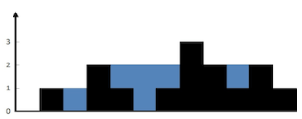

# LeetCode 42. Trapping Rain Water

[link to LeetCode](https://leetcode.com/problems/trapping-rain-water/) (<span style="color:red">hard</span>)

## Description
Given `n` non-negative integers representing an elevation map where the width of each bar is `1`, compute how much water it can trap after raining.
## Constraints
-   `n == height.length`
-   `1 <= n <= 2 * 10*4`
-   `0 <= height[i] <= 10*5`
## Examples
<div align="center">


</div>

**Input:** `height = [0,1,0,2,1,0,1,3,2,1,2,1]`

**Output:** `6`

**Explanation:** 
The above elevation map (black section) is represented by array `[0,1,0,2,1,0,1,3,2,1,2,1]`. In this case, 6 units of rain water (blue section) are being trapped.

## Abstract (TL;DR)
Let's call `max_ind` - the index of the max element in `height`.  We can iterate from `0` to `max_ind` (left to right), counting the value of `max_val` - the maximum value we've encountered so far. When we have `height[i] < max_val`, we add `ans += max_val - height[i]` because the water will be trapped anyways at this column: it has `max_val` on some position to its left and it has `height[max_ind]` somewhere to its right.

Repeat the procedure for `len - 1` and `max_ind` (right to left).

## Thoughts

### Solution 1 (left to max, right to max)
The newest one (one week ago).
```python
class Solution:
    def trap(self, height: List[int]) -> int:
        ans = []
        mx = 0
        for h in height:
            mx = max(mx, h)
            ans.append(mx - h)
        
        mx = 0
        for i in range(len(height) - 1, -1, -1):
            h = height[i]
            mx = max(mx, h)
            ans[i] = min(ans[i], mx - h)
        
        return sum(ans)
```

The old one (one month ago).
```python
class Solution:
    def trap(self, height: List[int]) -> int:
        if not height:
            return 0
        
        def calc(a, b):
            rng = range(a, b + 1) if a <= b else range(a, b - 1, -1)
            answer = puddle = 0
            max_height = -1
            for i in rng:
                if height[i] >= max_height:
                    answer += puddle
                    puddle = 0
                    max_height = height[i]
                else:
                    puddle += max_height - height[i]
            return answer
        
        max_index = max(enumerate(height), key=lambda e: e[1])[0]
        n = len(height)
        return calc(0, max_index) + calc(n - 1, max_index)
```
